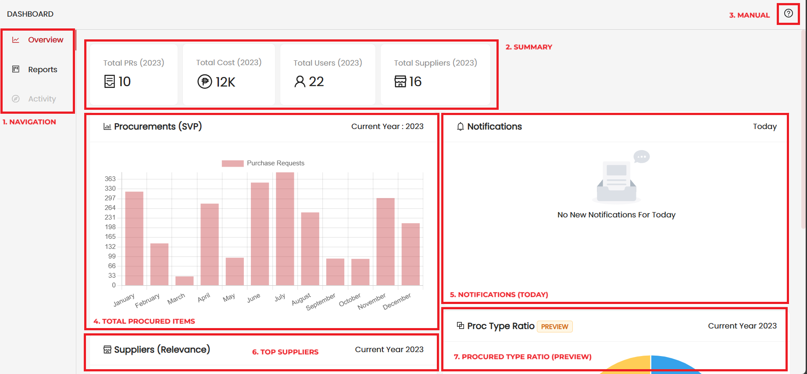
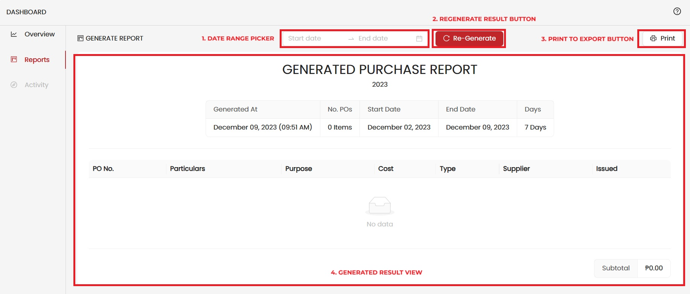

import { Avatar, Steps, Tag } from "antd";
import {
    CompassOutlined,
    BarChartOutlined,
    LineChartOutlined,
    ProjectOutlined,
    QuestionCircleOutlined,
    WarningOutlined,
} from "@ant-design/icons";

The Dashboard Manual, Steps how to use the Dashboard Page

---

##### <LineChartOutlined/>&nbsp;Overview and Layout

Dashboard Layout and Panel Description

<Steps direction="vertical">
    <Steps.Step
        status="process"
        title="Navigation"
        subTitle={
            <>
                (<LineChartOutlined />
                &nbsp;
                <ProjectOutlined />
                &nbsp;
                <CompassOutlined />)
            </>
        }
        description={
            <>
                Dashboard <b>Navigation</b> Allows the Alternatingly Traverse Between the Overview and Reports Generator
            </>
        }
    />
    <Steps.Step
        status="process"
        title="Summaries"
        subTitle={
            <>
                (<BarChartOutlined />)
            </>
        }
        description={
            <>
                View the <b>Total</b> Procured Items within the current <b>Year</b>
            </>
        }
    />
    <Steps.Step
        title="Manual"
        status="process"
        subTitle={
            <>
                ( <QuestionCircleOutlined />)
            </>
        }
        description={
            <>
                Manual Button will open this page you are currently viewing which highlights and describes what do you
                see on the screen.
            </>
        }
    />
    <Steps.Step status="process" title="Total Procured" description={
        <>
            Rendered Total Procured Items in current Year 12 Month Range
        </>
    } />
    <Steps.Step status="process" title="Notifications (Today)" description={
        <>
            Active Notifications <i>(Today)</i> All Notification within 24 Hour Clock
        </>
    } />
    <Steps.Step status="process" title="Top Suppliers" description={
        <>Top 5 Performing Suppliers Based from Selection Chance, Number of Delays, and Number of Extends, and Number of Completed within the Delivery Date</>
    } />
    <Steps.Step
        status="process"
        title="Procured Type Ratio"
        subTitle="PREVIEW"
        description={
            <>
                <Tag color="orange">PREVIEW</Tag>&nbsp;Procured Item Type is in PREVIEW status since the only supported procurement type at this momment is the <strong>Small-Value Procurement</strong>. 
            </>
        }
    />

</Steps>

---

##### <ProjectOutlined/>&nbsp;Reports

Generates Reports based on a customizable Date Range Selector. This also allows the ability to print the reports as is.

> <WarningOutlined /> &nbsp;Generated Reports are based on Purchase Order not Purchase Requests

<Steps direction="vertical">
    <Steps.Step
        title="Date Range Picker"
        status="process"
        description={
            <>
                Picker for Date Range. Pick the <b>Start Date</b> and <b>End Date</b> in which the generated Reports are
                filtered from.
            </>
        }
    />
    <Steps.Step
        status="process"
        title="Re-Generate Result"
        description={
            <>
                Regenerate Button, after picking the date range the system will <b>Filter</b> Purchase Orders that
                adheres to the Date Range Applied.
            </>
        }
    />
    <Steps.Step
        status="process"
        title="Export to Print"
        description={<>Export the Generated Records as a printable medium</>}
    />
    <Steps.Step
        status="process"
        title="Generated Result"
        description={
            <>
                Generated Result layouts the reports filtered Purchase Orders which allows viewing the <b>Date Range</b>,{" "}
                <b>Number of Days</b>, <b>Start and End Date</b>, <b>Number of Purchase Orders</b>, and <b>
                    Total Cost
                </b>.
            </>
        }
    />
</Steps>
