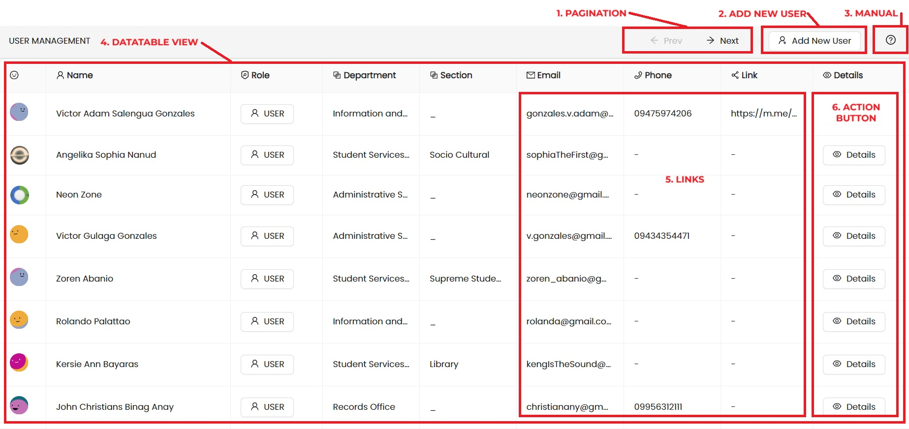
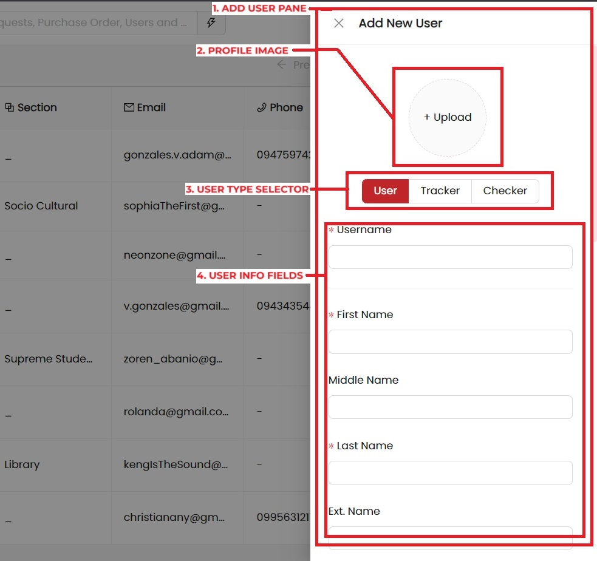
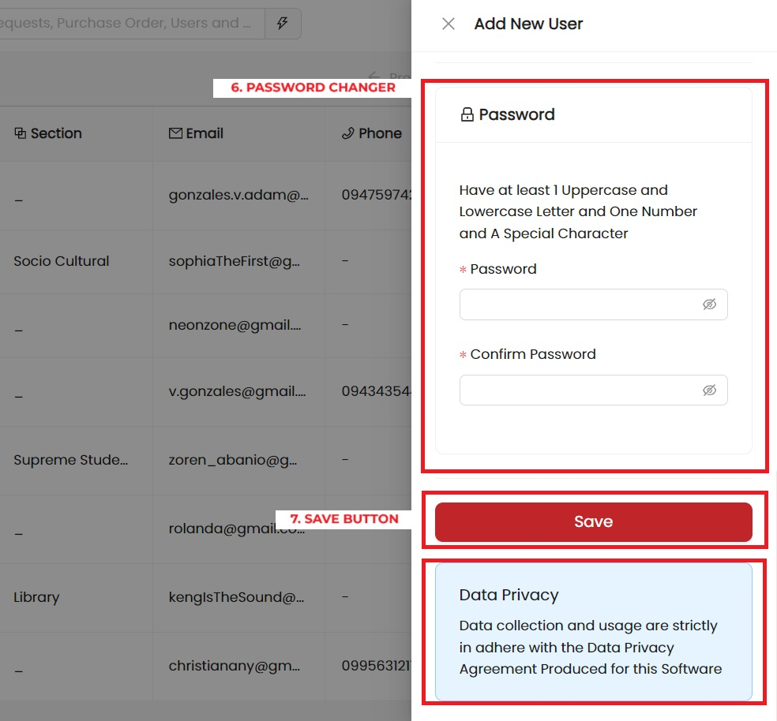

import { Steps, Tag, Button } from "antd";
import { ArrowLeftOutlined, ArrowRightOutlined, UserAddOutlined,  } from "@ant-design/icons";

##### User Management Layout

        <Steps direction="vertical">
                    <Steps.Step
                            status="process"
                            title="Pagination Control"
                            description={
                                <>
                                    Control active pagination of records.  <Button style={{ pointerEvents: 'none' }} icon={<ArrowLeftOutlined />}>Previous</Button> and <Button style={{ pointerEvents: 'none' }} icon={<ArrowRightOutlined />}>Next</Button>  Pagination size can be upated on <strong><code>Settings &gt; Options</code></strong>
                                </>
                            }
                        />
    <Steps.Step
                    status="process"
                    title="Add New User"
                    subTitle={<UserAddOutlined />}
                    description={
                        <>
                            Refer Details Below...
                        </>
                    }
                />
    <Steps.Step
                    title="Manual"
                    status="process"
                    description={
                        <>
                            Manual Button will open this page you are currently viewing which highlights and describes what do you
                            see on the screen.
                        </>
                    }
                />
    <Steps.Step status="process" title="Datatable View" description={
                    <>
                        Tabulated View of the User Information Lists.
                    </>
                } />
    <Steps.Step status="process" title="URL Links" description={
                    <>
                        This row items links can be redirected to or copied. <strong>Click</strong> to show a popup wherein listed a <em>Visit</em> and <em>Copy Button</em>. <strong>Visit Link</strong> will redirect the page to either one of the row type which is <em>Email</em> -&gt; Email App, <em>Phone</em> -&gt; Phone App, and <em>Social Link</em> -&gt; New Browser Tab.
                    </>
                } />
    <Steps.Step status="process" title="Action Button" description={
                    <>Action Button will open the Details Page of the Selected User</>
                } />

                    </Steps>

---

##### Add New User Pane <UserAddOutlined />

To Add New User Click the
        <Button style={{ pointerEvents: "none" }} icon={<UserAddOutlined />}>Add New User</Button>
the Add New User Drawer will show up.

> **NOTE.** Closing this panel will disregared all your changes.

        <Steps direction="vertical">
                    <Steps.Step
                            status="process"
                            title="Add New User Panel"
                            description={
                                <>
                                    When the <strong>Add New User</strong> Button is clicked the Add User Panel will show on the side.
                                </>
                            }
                        />
    <Steps.Step
                    status="process"
                    title="Profile Image"
                    description={
                        <>
                            Profile Image Selector is a <Tag color="orange">PREVIEW</Tag> feature, which allows assigning a profile image for
                            the newly created image, if left empty the system will assign a temporary Avatar{" "}
                            <em>ref. BoringAvatars</em>.

                        </>
                    }
                />
    <Steps.Step
                    title="User Type Selector"
                    status="process"
                    description={
                        <>
                            Select User Type. There are three type of user that you can create namely <strong>User</strong> which is
                            the <em>default</em>, <strong>Tracker</strong> Utility user, and <strong>Checker</strong> Utility user.
                        </>
                    }
                />
    <Steps.Step
                    status="process"
                    title="User Information Fields"
                    description={<>User Information including basic name, contact, and office designation</>}
                />

                    </Steps>

        <Steps direction="vertical">
                    <Steps.Step
                            status="process"
                            title="User Password"
                            description={
                                <>
                                    User Password, in the USER type password 
                                </>
                            }
                        />
    <Steps.Step
                    status="process"
                    title="Add New User Button"
                    description={
                        <>
                            (Only) When all information satisfied including that means all field with asterik (*) <strong>REQUIRED</strong> are filled and ok that Adding User is allowed.
                        </>
                    }
                />
                    </Steps>
